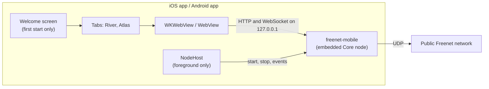

# freenet-appkit

Freenet AppKit for iOS and Android: River and Atlas on a Freenet node that runs inside the app.

The Rust side lives in [freenet-core](https://github.com/freenet/freenet-core) as `crates/mobile` (package `freenet-mobile`). It embeds a node in the app process and exposes it to Swift and Kotlin through [UniFFI](https://mozilla.github.io/uniffi-rs/latest/). This repository packages that library for each platform and builds the apps on it.



## What is here

| Path | Contents |
| --- | --- |
| `Package.swift`, `Sources/FreenetAppKit/` | Swift package: the generated bindings, directory helpers, the bundle scheme handler and the WebView bridge host |
| `android/appkit/` | Kotlin library: the generated bindings, the native libraries for each ABI, the bundle server and bridge host |
| `ios/` | iOS app (SwiftUI) |
| `android/demo/` | Android app |
| `art/` | App icon art for both platforms |
| `scripts/` | Library, app and store builds, and the store build check |
| `results/`, `docs/` | Results of 1.1 Mobile feasibility and supported profiles ([support matrix](docs/support-matrix.md), [device results](docs/device-results.md), [findings](docs/findings.md)), the [distribution review](docs/distribution-review.md), the [store build plan](docs/store-build-plan.md) and the [review notes](docs/review-notes.md) |

The harness and measurement scenarios that produced `results/` are at git tag `plan-1.1-harness`.

## The app

| | iOS | Android |
| --- | --- | --- |
| Name on the home screen | AppKit | AppKit |
| Store name | Freenet AppKit | Freenet AppKit |
| Identifier | `freenet.appkit` | `freenet.appkit` |
| Lowest OS | iOS 16, iPhone | Android 8 (API 26) |

Two tabs, River and Atlas. The embedded node joins the public Freenet network, fetches each web app's website container and serves it to the web view on `127.0.0.1`.

The node runs only while the app is open. It stops when the app moves to the background and starts a fresh session when the app returns; the page stays on screen with a "Reconnecting" label until the new session has drawn it. Message alerts appear only while the app is open.

## Build and run

Needs Xcode, the Android SDK with NDK r29, Rust with the targets below, and the neighbouring checkout `../freenet-core`.

```bash
rustup target add --toolchain 1.94.0 aarch64-apple-ios aarch64-apple-ios-sim aarch64-linux-android x86_64-linux-android armv7-linux-androideabi
```

Build the libraries:

```bash
scripts/build-ios.sh
```

```bash
scripts/build-android.sh
```

Build the apps for the simulator, a phone or the emulator:

```bash
scripts/build-ios-app.sh Release simulator
```

```bash
DEVICE_ID=<udid> DEVELOPMENT_TEAM=<team> scripts/build-ios-app.sh Release device
```

```bash
scripts/build-android-app.sh Release
```

## Store builds

Each store build needs a number that goes up on every upload. The iOS build needs the project's paid Apple Developer Program team. The Android build needs the upload key: copy `android/keystore.properties.example` to `android/keystore.properties` and fill it in.

```bash
DEVELOPMENT_TEAM=<team> BUILD_NUMBER=<n> scripts/archive-ios.sh
```

```bash
VERSION_CODE=<n> scripts/bundle-android.sh
```

Both scripts finish with `scripts/check-store-build.sh`, which checks the package for the icon, the privacy manifest, the encryption key, iPhone only, release signing, 16 KB alignment and the absence of test code. It can also be run on any built `.app`, `.apk` or `.aab`:

```bash
scripts/check-store-build.sh ios build/ios/DerivedData/Build/Products/Release-iphonesimulator/AppKitDemo.app
```

```bash
scripts/check-store-build.sh android android/demo/build/outputs/apk/release/demo-arm64-v8a-release.apk
```

Text for App Review and Play review is in [review notes](docs/review-notes.md).
