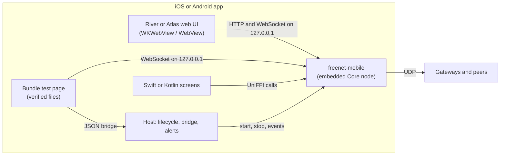

# freenet-appkit

Freenet on iOS and Android: demo apps, a measurement harness, the support matrix and device results for plan 1.1 Mobile feasibility and supported profiles.

The Rust side lives in [freenet-core](https://github.com/freenet/freenet-core) as `crates/mobile` (package `freenet-mobile`). It embeds a node in the app process and exposes it to Swift and Kotlin through [UniFFI](https://mozilla.github.io/uniffi-rs/latest/). This repository packages that library for each platform and builds the apps on it.



## What is here

| Path | Contents |
| --- | --- |
| `Package.swift`, `Sources/FreenetAppKit/` | Swift package: the generated bindings, directory helpers, the bundle scheme handler and the WebView bridge host |
| `android/appkit/` | Kotlin library: the generated bindings, the native libraries for each ABI, the bundle server and bridge host |
| `ios/` | iOS demo app (SwiftUI) |
| `android/demo/` | Android demo app |
| `web/bridge-test/` | The host-served test page for the JSON bridge and the SHA-256 manifest |
| `harness/` | Host-side harness: builds, launches scenarios on simulators, emulators and devices, collects results and renders reports |
| `fixtures/` | Shared protocol fixtures written on desktop, and the pins for River's and Atlas's website containers |
| `results/` | Stored results, one folder per run |
| `docs/` | [Support matrix](docs/support-matrix.md), [device results](docs/device-results.md), [distribution review](docs/distribution-review.md) and [findings](docs/findings.md) |

## The demo apps

Both apps have the same five screens.

| Screen | What it shows |
| --- | --- |
| River | River's web UI, served by the embedded node from River's website container |
| Atlas | Atlas's web UI, served the same way |
| Bridge | A test page from the app's own files: the JSON bridge, the manifest check and the page's own WebSocket to the node |
| Native | Swift or Kotlin calling put, get, update and subscribe directly, compared with the desktop fixture values |
| Node | Status, network profile, alert permission, conformance and fixture runs, build details |

The node runs only while the app is in the foreground. It stops when the app moves to the background and starts a fresh session when the app returns. Message alerts appear only while the app is open.

Three network profiles. The apps start on Public until you pick another one on the Node screen:

| Profile | The node | River and Atlas come from |
| --- | --- | --- |
| Local | An isolated node, nothing leaves the phone | The pinned containers in the app, stored into the node on first use |
| Test gateway | Joins through a gateway override | The isolated gateway on the development Mac |
| Public | Joins through the public gateway index | The live network |

## Build and run

Needs Xcode, the Android SDK with NDK r29, Rust with the targets below, and the neighbouring checkouts `../freenet-core`, `../river` and `../atlas`.

```bash
rustup target add --toolchain 1.94.0 aarch64-apple-ios aarch64-apple-ios-sim aarch64-linux-android x86_64-linux-android armv7-linux-androideabi
```

```bash
scripts/generate-fixtures.sh
```

```bash
scripts/fetch-webapps.sh
```

```bash
scripts/prepare-resources.sh
```

```bash
scripts/build-ios.sh && harness/build-ios-app.sh Release simulator
```

```bash
scripts/build-android.sh && harness/build-android-app.sh Release
```

Then run scenarios. The app runs each scenario itself and writes a JSON result; the harness collects it into `results/`.

```bash
harness/run.py ios-sim conformance fixtures native startup lifecycle bridge river atlas storage throughput alerts --profile local
```

```bash
harness/run.py android-emu conformance fixtures native startup lifecycle bridge river atlas storage throughput alerts --profile local
```

On a connected iPhone (Developer Mode on), build with your signing team and use the `ios-device` target:

```bash
DEVICE_ID=<udid> DEVELOPMENT_TEAM=<team> harness/build-ios-app.sh Release device
```

```bash
harness/run.py ios-device conformance fixtures native startup lifecycle bridge river atlas storage throughput alerts wasm_instances --profile local
```

```bash
harness/report.py
```

For the test-gateway profile, start the isolated gateway first and pass its key:

```bash
../freenet-core/target/release/examples/isolated_gateway --dir harness/.run/gateway --load fixtures/webapps/river --load fixtures/webapps/atlas --info harness/.run/gateway/info.json
```

The emulator reaches the Mac at `10.0.2.2`; a phone on the same Wi-Fi needs `--bind <Mac LAN address>`.

## Scenarios

| Scenario | Measures |
| --- | --- |
| `conformance` | Wasm backend conformance on every backend the target has, and refusal of the others |
| `fixtures` | Protocol fixtures against desktop: encodings, results, typed errors, cancellation, callback order |
| `native` | The Swift or Kotlin route against desktop, and large-record copying split by layer |
| `startup` | Process start to first frame, node start, stop and restart |
| `lifecycle` | Three stop and start cycles, each with a fresh session |
| `bridge` | The bundle page's checks and bridge round-trip time |
| `river`, `atlas` | Load timeline, peer traffic and memory with the app open |
| `resume` | Returning to River after another app (with `--during resume`) |
| `watch` | Peer count and traffic over time (with `--during wifi-toggle` or `offline` on Android) |
| `throughput` | Subscription updates per second |
| `alerts` | A page notification reaching the host's banner and the tap reaching the page |
| `wasm_instances` | Contracts stored until the device refuses, and the address space each takes |
| `transition` | Guided on the phone's screen: Wi-Fi off, a minute on cellular, Wi-Fi on; peers, traffic and path each second |
| `offline_start` | Guided: the node started in Airplane Mode, then again once back online |
| `cellular_start` | Guided: a fresh node start on cellular, through the carrier's NAT |
| `storage` | Store, cache and log sizes |
