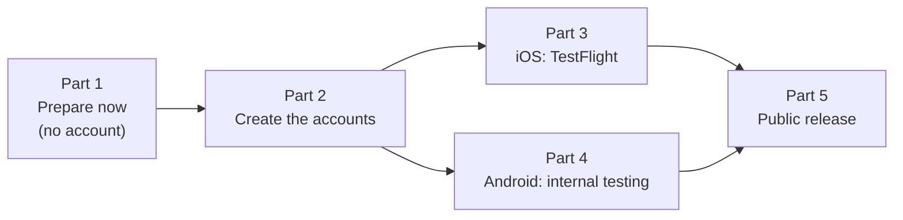

# Release plan

What is left to ship Freenet AppKit to TestFlight and Google Play internal testing, and then to the App Store and Google Play. Everything in [store build plan](store-build-plan.md) up to signing is done on branch `store-build`. This plan starts where that one stopped: the developer accounts.



## Facts

### Names and identifiers

| Item | iOS | Android |
| --- | --- | --- |
| Store name | Freenet AppKit | Freenet AppKit |
| Home screen / launcher name | AppKit | AppKit |
| Identifier (permanent once the store record exists) | Bundle ID `freenet.appkit` | Package name `freenet.appkit` |
| Code package | – | `org.freenet.appkit.demo` (Gradle `namespace`; users never see it) |
| Version shown to users | `MARKETING_VERSION = 0.1` in `ios/AppKitDemo.xcodeproj/project.pbxproj` | `versionName`, default `0.1`, or `VERSION_NAME=` for `scripts/bundle-android.sh` |
| Build number (must go up on every upload) | `BUILD_NUMBER=` for `scripts/archive-ios.sh` (sets `CURRENT_PROJECT_VERSION`) | `VERSION_CODE=` for `scripts/bundle-android.sh` |
| Store category | Social Networking (`public.app-category.social-networking`) | Communication |
| Devices and lowest OS | iPhone only, iOS 16.0 | Phones, Android 8.0 (API 26), target API 36 |
| Price | Free | Free |

Use one build number for both platforms per release, from the date and hour: `date +%y%m%d%H` (for example `26100109`). It always goes up, and it fits Android's version code limit (2,100,000,000).

### Where things live

| What | Path |
| --- | --- |
| iOS project | `ios/AppKitDemo.xcodeproj`, scheme `AppKitDemo` |
| iOS names, encryption key, local network text | `ios/AppKitDemo.xcodeproj/project.pbxproj` (`INFOPLIST_KEY_*` build settings) |
| iOS privacy manifest | `ios/AppKitDemo/PrivacyInfo.xcprivacy` |
| iOS icon | `ios/AppKitDemo/Assets.xcassets/AppIcon.appiconset/` |
| iOS export settings | `ios/ExportOptions.plist` (`app-store-connect`, `export`, automatic signing; the script writes the team ID into `build/ios/ExportOptions.plist`) |
| Android app build | `android/demo/build.gradle.kts` (application ID, versions, upload signing) |
| Android names | `android/demo/src/main/res/values/strings.xml` |
| Android icon | `android/demo/src/main/res/mipmap-anydpi-v26/ic_launcher.xml`, `res/drawable/ic_launcher_foreground.xml` |
| Upload key settings (not in git) | `android/keystore.properties`, from `android/keystore.properties.example` |
| Terms and support links in the app | `ios/AppKitDemo/AppInfo.swift`, `android/demo/src/main/java/org/freenet/appkit/demo/AppInfo.kt` |
| Icon art | `art/icon-1024.png` (App Store), `art/icon-play-512.png` (Play) |
| Review text | `docs/review-notes.md` |
| Store listing text and images (created in Part 1) | `store/` |
| Build scripts | `scripts/build-ios.sh`, `scripts/build-android.sh` (Rust libraries), `scripts/archive-ios.sh`, `scripts/bundle-android.sh` (store packages), `scripts/check-store-build.sh` |
| Store packages | `build/ios/export/AppKitDemo.ipa`, `android/demo/build/outputs/bundle/release/demo-release.aab` |

### Secrets

| Secret | Where it goes | Kept in |
| --- | --- | --- |
| Apple ID and 2FA of the account holder | Xcode → Settings → Accounts | The project's password manager |
| App Store Connect API key (`AuthKey_<KEYID>.p8`, key ID, issuer ID) | `~/.appstoreconnect/private_keys/` on the build Mac | Password manager (the `.p8` downloads once only) |
| Android upload keystore (`upload.keystore`) and its passwords | `android/upload.keystore` (ignored by `*.keystore`) and `android/keystore.properties` | Password manager, with a second copy of the keystore file |
| Play App Signing key | Held by Google | – |

### Placeholders still in the app and the docs

| Placeholder | File | Replace with |
| --- | --- | --- |
| `https://freenet.org/terms` | `AppInfo.swift`, `AppInfo.kt` | The live terms page |
| `https://freenet.org/support` | `AppInfo.swift`, `AppInfo.kt` | The live support page |
| `DEVELOPMENT_TEAM = 995A4BQX6K` (uncommitted, in the working tree) | `project.pbxproj` | The paid team's ID (the free personal team can't use TestFlight) |
| `$(DEVELOPMENT_TEAM)` | `ios/ExportOptions.plist` | Leave it: the script fills it in |
| `<VIDEO_LINK>`, `<SUPPORT_EMAIL>` | `docs/review-notes.md` | The recording link and the support address |

## Decisions to make before Part 2

| Decision | Options | Effect |
| --- | --- | --- |
| Who publishes | An organization (the Freenet project's legal entity) or a person | Store pages show this name as the seller or developer. Organization accounts need a D-U-N-S number on both stores, and getting one can take up to two weeks |
| Support contact | An email address that someone reads | Goes into both store listings, the support page and `docs/review-notes.md` |
| Distribution in France | Include France or leave it out | Including it needs a French encryption declaration uploaded to App Store Connect |
| Age rating target | 13+, 16+ or 18+ | River is open chat with strangers. 18+ on Play keeps the app out of the Families policy |
| A lasting privacy link in the app | Welcome screen only (Task 1.2), or also an info button on the tab bar | Apple asks for a privacy policy that is easy to reach inside the app. The welcome screen shows once |

---

## Part 1: Prepare now (no account needed)

### Task 1.1: Publish the web pages

The stores and the app link to these. They must be live before the first external review.

| Page | Contents | Needed by |
| --- | --- | --- |
| Terms of use | The rules for posting in River, and a statement that there is no tolerance for objectionable content or abusive users | App (welcome screen), Play UGC policy, App Review guideline 1.2 |
| Privacy policy | What the app keeps on the phone, what it sends to other peers (messages, public keys, IP address), that there is no server or analytics, how to delete data (delete the app) | App Store Connect, Play Console, the app |
| Support | The support email, how to report content and users, known limits (the app works only while open, networks that block UDP) | App Store Connect "Support URL", Play contact details |
| Child safety standards | How the project handles child sexual abuse material and who to contact | Play (required for social and chat apps) |

- [ ] Write and publish the four pages, for example under `https://freenet.org/appkit/`.
- [ ] Note the four URLs in the Facts section of this plan.

### Task 1.2: Put the final links in the app

Files: `ios/AppKitDemo/AppInfo.swift`, `ios/AppKitDemo/WelcomeScreen.swift`, `android/demo/src/main/java/org/freenet/appkit/demo/AppInfo.kt`, `android/demo/src/main/java/org/freenet/appkit/demo/WelcomeScreen.kt`

- [ ] Replace `termsURL`/`termsUrl` and `supportURL`/`supportUrl` with the live URLs from Task 1.1.
- [ ] Add `privacyURL` (Swift) and `privacyUrl` (Kotlin) with the privacy policy URL.
- [ ] On both welcome screens, change the line to "By continuing you agree to the Terms and the Privacy Policy." Link both phrases, following the pattern already used for "Terms" (`AttributedString(markdown:)` on iOS, `linked(...)` on Android).
- [ ] Build and run both apps. Delete the app first, so the welcome screen shows. Tap each link and check that it opens the right page:
  ```bash
  scripts/build-ios-app.sh Release simulator
  ```
  ```bash
  scripts/build-android-app.sh Release
  ```
- [ ] Commit: `Link the live terms, privacy and support pages`.

### Task 1.3: Store listing text

Create `store/listing.md` with the text for both stores. Counts are the stores' limits.

| Field | Store | Limit | Draft |
| --- | --- | --- | --- |
| Name | Both | 30 | Freenet AppKit |
| Subtitle | App Store | 30 | Chat and browse on Freenet |
| Short description | Play | 80 | River chat and the Atlas directory, on a Freenet peer that runs on your phone. |
| Keywords | App Store | 100 | freenet,peer to peer,p2p,decentralized,chat,group chat,river,atlas,private |
| Promotional text | App Store | 170 | Chat in River rooms and browse Atlas, served by a Freenet peer inside the app. No servers, no sign-up. |
| Description | Both | 4000 | What River and Atlas are; that the app runs a Freenet peer on the phone; no account; runs only while open; first connection can take a minute; link to support |
| Release notes | Both | 4000 / 500 | First test build |
| Copyright | App Store | – | `2026 <publisher name>` |

- [ ] Write `store/listing.md` from the table, with the full description written out.
- [ ] Commit: `Store listing text`.

### Task 1.4: Store images

| Image | Store | Size | Source |
| --- | --- | --- | --- |
| App icon | App Store | 1024 × 1024 | Taken from the build (`AppIcon`) |
| App icon | Play | 512 × 512 PNG | `art/icon-play-512.png` |
| Feature graphic | Play | 1024 × 500 PNG or JPEG | New: `art/feature-graphic.png`, the icon's three peers on `#1A5FD0` with "Freenet AppKit" |
| Phone screenshots | App Store | 6.9-inch: 1320 × 2868 (at least 1, up to 10) | iPhone 17 Pro Max simulator: `xcrun simctl io booted screenshot` |
| Phone screenshots | Play | 1080 × 1920 or larger, 9:16 (at least 2, up to 8) | `Pixel_10` emulator: `adb exec-out screencap -p` |

Screenshots to take on each platform: welcome screen, River room with messages, River room list, Atlas directory. Wait until River PR 21 (the no-room screen) ships on the network before taking the welcome and room-list shots. Until then, take them inside a room.

- [ ] Draw `art/feature-graphic.png` the same way `art/icon-1024.png` was drawn (see `art/README.md`).
- [ ] Take the screenshots into `store/screenshots/ios/` and `store/screenshots/android/`, named `01-welcome.png`, `02-room.png`, and so on.
- [ ] Commit: `Store images`.

### Task 1.5: Review recording

- [ ] Record the steps in `docs/review-notes.md` (Continue on the welcome screen, River loads, create a room, send a message, open Atlas): on the iPhone 13 mini with QuickTime (File → New Movie Recording, choose the iPhone), and on the emulator with `adb shell screenrecord /sdcard/review.mp4`.
- [ ] Upload both as unlisted videos. Put the link and the support email into `docs/review-notes.md` in place of `<VIDEO_LINK>` and `<SUPPORT_EMAIL>`.
- [ ] Commit: `Review notes: recording and contact`.

---

## Part 2: Create the accounts

### Task 2.1: Apple Developer Program

- [ ] Enroll at <https://developer.apple.com/programs/enroll/> as the chosen publisher (US$99 a year). An organization needs its D-U-N-S number, legal name and a website on its own domain.
- [ ] Wait for approval, then note the **Team ID** (Membership details on developer.apple.com, 10 characters).
- [ ] In App Store Connect → Users and Access, invite everyone who builds or tests. Builders need the App Manager role. Internal testers need any role.
- [ ] On the build Mac: Xcode → Settings → Accounts → add the Apple ID. Check that the team shows with the "Apple Developer Program" type, not "Personal Team".
- [ ] App Store Connect → Users and Access → Integrations → App Store Connect API → create a key with the App Manager role. Download `AuthKey_<KEYID>.p8` into `~/.appstoreconnect/private_keys/`. Note the key ID and the issuer ID, and save all three in the password manager.
- [ ] In the Business section, accept the Paid Apps agreement only if paid features ever come. The Free Apps agreement is accepted with the membership.

### Task 2.2: Google Play Console

- [ ] Sign up at <https://play.google.com/console/signup> as the chosen publisher (US$25 once). Complete identity verification. An organization needs its D-U-N-S number.
- [ ] Note the account type. A **personal** account created after 13 November 2023 must run a closed test with at least 12 testers for 14 days in a row before it can publish to production. Internal testing is open right away.
- [ ] Settings → Developer account → Users and permissions: invite the builders (Release manager) and the internal testers (by email).

---

## Part 3: iOS, to TestFlight

### Task 3.1: Point the project at the paid team

Files: `ios/AppKitDemo.xcodeproj/project.pbxproj`

- [ ] Replace `DEVELOPMENT_TEAM = 995A4BQX6K;` (the free personal team, uncommitted today) with the paid Team ID from Task 2.1, in both build configurations.
- [ ] Commit: `iOS: sign with the Freenet AppKit team`. The Team ID is not a secret.

### Task 3.2: Register the bundle ID and create the app record

- [ ] developer.apple.com → Certificates, Identifiers & Profiles → Identifiers → + → App IDs → App. Description `Freenet AppKit`, explicit bundle ID `freenet.appkit`. Leave every capability off: the app uses no push, iCloud or App Groups.
- [ ] App Store Connect → Apps → + → New App:

  | Field | Value |
  | --- | --- |
  | Platform | iOS |
  | Name | Freenet AppKit (names are unique across the App Store; if it's taken, stop and pick another store name, which changes only `store/listing.md` and the review notes) |
  | Primary language | English (U.S.) |
  | Bundle ID | `freenet.appkit` |
  | SKU | `freenet-appkit` |
  | User access | Full access |

### Task 3.3: Archive and export

- [ ] Build the Rust library for device and simulator:
  ```bash
  scripts/build-ios.sh
  ```
- [ ] Archive, export and check. Automatic signing creates the Apple Distribution certificate and the App Store profile on the first run:
  ```bash
  DEVELOPMENT_TEAM=<team id> BUILD_NUMBER=$(date +%y%m%d%H) scripts/archive-ios.sh
  ```
  Expected: `build/ios/export/AppKitDemo.ipa`, and the check script's last line is `all checks passed`.

### Task 3.4: Upload

- [ ] Upload with the API key from Task 2.1:
  ```bash
  xcrun altool --upload-app -f build/ios/export/AppKitDemo.ipa -t ios --apiKey <KEYID> --apiIssuer <ISSUER_ID>
  ```
  Transporter (Mac App Store) and Xcode Organizer (Window → Organizer → Distribute App) work too.
- [ ] Wait for the processing email (often 15 to 30 minutes). Apple emails any problems with the binary. An `ITMS-91053` email means the privacy manifest is missing a reason. List the library's symbols as `docs/store-build-plan.md` Task 5 step 2 shows, then add the category to `PrivacyInfo.xcprivacy`.

### Task 3.5: Export compliance

`ITSAppUsesNonExemptEncryption = YES` is set, so App Store Connect asks about encryption on the first build.

- [ ] Answer: the app uses encryption; it uses standard algorithms (X25519, AES-GCM, ChaCha20, Ed25519, BLAKE3) instead of, or as well as, Apple's; it is available in France or not, as decided before Part 2.
- [ ] If France is included, upload the French encryption declaration when asked.
- [ ] If App Store Connect shows an export compliance code, add `INFOPLIST_KEY_ITSEncryptionExportComplianceCode = <code>;` to both configurations in `project.pbxproj`, so later builds skip the questions. Commit: `iOS: export compliance code`.
- [ ] Add a calendar reminder for the US annual self-classification report to BIS for mass-market encryption. It is due by 1 February each year for the previous year. See [Apple's export compliance page](https://developer.apple.com/documentation/security/complying-with-encryption-export-regulations).

### Task 3.6: Internal testing

- [ ] App Store Connect → the app → TestFlight → Internal Testing → + → group `Team`, with automatic distribution on. Add the internal testers.
- [ ] Fill in Test Information: beta app description (the first paragraph of the App Review notes), feedback email (the support address).
- [ ] Install TestFlight on the iPhone 13 mini, accept the invite, install the build, and run the checklist in Part 6.

### Task 3.7: External testing (after internal testing passes)

- [ ] TestFlight → External Testing → + → group `Beta`. Add the build. Fill in Beta App Review Information: contact, "Sign-in required: No", and the review notes from `docs/review-notes.md`.
- [ ] Submit for Beta App Review. Only the first build of each version is reviewed. When approved, turn on the public link or add testers by email.

---

## Part 4: Android, to Play internal testing

### Task 4.1: Create the upload key

- [ ] Create the keystore in `android/`. The file is ignored by `*.keystore`:
  ```bash
  keytool -genkeypair -v -keystore android/upload.keystore -alias upload -keyalg RSA -keysize 4096 -validity 10000
  ```
  Android Studio's bundled Java has `keytool`: `"/Applications/Android Studio.app/Contents/jbr/Contents/Home/bin/keytool"`.
- [ ] Copy `android/keystore.properties.example` to `android/keystore.properties` and fill it in:
  ```properties
  storeFile=upload.keystore
  storePassword=<store password>
  keyAlias=upload
  keyPassword=<key password>
  ```
- [ ] Save the keystore file and both passwords in the password manager. Keep a second copy of the keystore. Losing it means asking Google support for an upload key reset.
- [ ] Check that neither file shows in `git status`.

### Task 4.2: Build the signed bundle

- [ ] Build the Rust libraries, then the bundle:
  ```bash
  scripts/build-android.sh
  ```
  ```bash
  VERSION_CODE=$(date +%y%m%d%H) scripts/bundle-android.sh
  ```
  Expected: `android/demo/build/outputs/bundle/release/demo-release.aab`, and every check passes, including "Not debug-signed".

### Task 4.3: Create the app

- [ ] Play Console → Create app:

  | Field | Value |
  | --- | --- |
  | App name | Freenet AppKit |
  | Default language | English (United States) – en-US |
  | App or game | App |
  | Free or paid | Free (this can't change to paid later) |
  | Declarations | Developer Program Policies and US export laws |

### Task 4.4: App content declarations

Play Console → Policy and programs → App content. Internal testing works before these are done, but closed testing and production need them.

| Declaration | Answer |
| --- | --- |
| Privacy policy | The URL from Task 1.1 |
| App access | All functionality is available without special access |
| Ads | No ads |
| Content rating (IARC questionnaire) | Category: Social / Communication. Users can talk to each other: yes. Shares location: no. Digital purchases: no |
| Target audience | The age target decided before Part 2 (not under 13) |
| Data safety | Collected and shared: messages and user IDs (public keys) sent to other peers, and the IP address the peer protocol sends. Say whether private rooms are end-to-end encrypted. Data is encrypted in transit. There is no account to delete: deleting the app removes the data |
| Government app, financial features, health, news | No |
| Child safety standards | The URL from Task 1.1, and a contact for child-safety reports |

### Task 4.5: Internal testing release

- [ ] Play Console → the app → Test and release → Testing → Internal testing → Create new release.
- [ ] Accept Play App Signing (Google holds the app signing key; the upload key from Task 4.1 only signs uploads).
- [ ] Upload `demo-release.aab`. Release name: the version code. Release notes: "First test build".
- [ ] Testers tab: create the email list `Team` and copy the opt-in link.
- [ ] On an Android phone signed in with a tester account, open the opt-in link, accept, install from Play, and run the checklist in Part 6.
- [ ] Open Test and release → Pre-launch report for this build, and fix any crash it finds. It runs on real devices, including Android 8 and 9.

### Task 4.6: Closed testing (personal accounts only)

- [ ] Create a closed testing track with at least 12 testers who stay opted in for 14 days in a row. Production access unlocks after that.

---

## Part 5: Public release

These go beyond test builds. They are needed before an App Store or Google Play production release.

| Item | Where | Why |
| --- | --- | --- |
| Reporting of objectionable content, blocking of users, and a published contact | River (repo `river`) | App Review guideline 1.2 and Play's user-generated content policy for chat apps |
| The no-room screen fills the panel | River plan `docs/plans/ui-ux-reimplementation/21-no-room-screen-fills-panel.plan.md` | The first screen shows a large blank band today |
| Rooms and menus add history entries, so back returns to the room list | River | Back inside River leaves River today |
| App Privacy answers (App Store Connect → App Privacy) | App Store Connect | Required to submit to the App Store; use the same facts as Play's Data safety form |
| Age rating questionnaire | App Store Connect → App Information | Required to submit; answer "user-generated content" and "messaging" |
| Screenshots, description, support URL, privacy URL, copyright | Both stores | From `store/` |
| Submit for review | App Store Connect → the version → Add for Review; Play → Production → Create release | – |

---

## Part 6: Checklist on each installed test build

Run it on the build installed from TestFlight and from the Play opt-in link, not a local build.

| Check | iOS | Android |
| --- | --- | --- |
| Icon and "AppKit" on the home screen | | |
| Welcome screen once; Terms, Privacy and Support open the right pages | | |
| River loads on Wi-Fi | | |
| River loads on mobile data | | |
| Atlas loads | | |
| Create a room and send a message | | |
| Leave for 10 s and return: the page stays, "Reconnecting", then it works | | |
| Airplane mode: plain error, "Try again", "Details" | | |
| Keyboard does not cover River's message field (a real phone; the emulator hid the on-screen keyboard) | | |
| A message alert while on the Atlas tab opens River | | |
| The local network prompt, if it shows, uses the text "Lets AppKit connect to Freenet devices on your Wi-Fi network." | | – |
