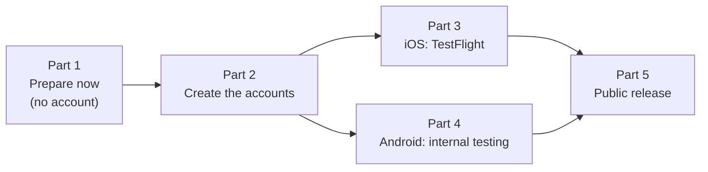
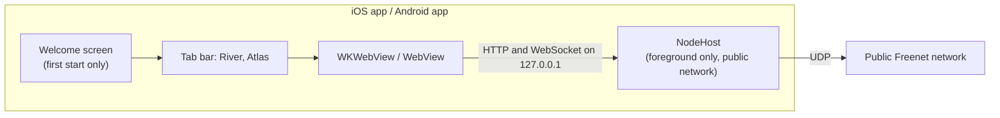

# Store build plan

This plan ships Freenet AppKit from branch `store-build` to TestFlight and Google Play internal testing, and then to the App Store and Google Play.



## The store build



| Feature | iOS | Android |
| --- | --- | --- |
| Screens | Welcome screen once, then River and Atlas tabs | Same, with a bottom tab bar (icons, selected state, TalkBack labels) |
| Network | Public network only | Same |
| Node lifecycle | Runs while the app is open; the page stays on screen with a "Reconnecting" pill when the app returns | Same |
| Loading and errors | Plain messages from `LoadMessages.swift`, with "Try again" and "Details" | Same, from `LoadMessages.kt` |
| Back | Swipe back through web view history | Back button and gesture through web view history, then home |
| Icon | `AppIcon` asset catalog | Adaptive icon with a monochrome layer |
| Store keys | Privacy manifest, `ITSAppUsesNonExemptEncryption = YES`, local network text, iPhone only | Upload signing from `keystore.properties`, version code from the command line |
| Debug tools | Web inspector in Debug builds only | Same |

The measurement harness for 1.1 Mobile feasibility and supported profiles is at git tag `plan-1.1-harness`.

### Store build check

`scripts/check-store-build.sh ios <.app>` and `scripts/check-store-build.sh android <.apk or .aab>` print one line per check and exit non-zero on any failure. `scripts/archive-ios.sh` and `scripts/bundle-android.sh` run it on their output.

| Platform | Check | How |
| --- | --- | --- |
| iOS | App icon compiled | `Assets.car` exists and `Info.plist` has `CFBundleIcons` |
| iOS | Privacy manifest present | `PrivacyInfo.xcprivacy` is in the `.app` |
| iOS | Encryption key set | `Info.plist` has `ITSAppUsesNonExemptEncryption` |
| iOS | No file sharing | `Info.plist` has no `UIFileSharingEnabled` |
| iOS | iPhone only | `UIDeviceFamily` is `[1]` |
| iOS, Android | No harness | The binary or `classes*.dex` has no `appkit.scenario` or `APPKIT_RESULT` |
| Android | Launcher icon | `aapt2 dump badging` shows `application-icon` |
| Android | Not profileable | The manifest has no `profileable` |
| Android | Not debug-signed | The signing certificate is not `CN=Android Debug` |
| Android | 16 KB aligned | `zipalign -c -P 16` passes (APK only; Play aligns the APKs it builds from an AAB) |

Today every iOS check passes, and every Android check passes except "Not debug-signed", which passes once the upload key exists (Task 4.1).

## Facts

### Names and identifiers

| Item | iOS | Android |
| --- | --- | --- |
| Store name | Freenet AppKit | Freenet AppKit |
| Home screen and launcher name | AppKit | AppKit |
| Identifier (permanent once the store record exists) | Bundle ID `freenet.appkit` | Package name `freenet.appkit` |
| Code package | Not applicable | `org.freenet.appkit.demo` (Gradle `namespace`; users never see it) |
| Version shown to users | `MARKETING_VERSION = 0.1` in `project.pbxproj` | `versionName` `0.1`, or `VERSION_NAME=` for `scripts/bundle-android.sh` |
| Build number (goes up on every upload) | `BUILD_NUMBER=` for `scripts/archive-ios.sh` | `VERSION_CODE=` for `scripts/bundle-android.sh` |
| Store category | Social Networking | Communication |
| Devices and lowest OS | iPhone, iOS 16.0 | Phones, Android 8.0 (API 26), target API 36 |
| Price | Free | Free |

Use one build number for both platforms per release: `date +%y%m%d%H`, for example `26100109`. It always goes up and fits under Android's version code limit of 2,100,000,000.

"AppKit" is also the name of Apple's framework for Mac apps, and guideline 5.2.5 bars Apple product names in app names. If App Review objects, only the home screen name changes (`INFOPLIST_KEY_CFBundleDisplayName` and `app_name`). The identifier and the store name stay.

### Where things live

| What | iOS | Android |
| --- | --- | --- |
| Project | `ios/AppKitDemo.xcodeproj`, scheme `AppKitDemo` | `android/`, module `:demo` |
| App entry and shell | `ios/AppKitDemo/AppKitDemoApp.swift` | `android/demo/src/main/java/org/freenet/appkit/demo/MainActivity.kt` |
| Node lifecycle | `NodeHost.swift` | `NodeHost.kt` |
| Web view | `WebAppScreen.swift`, `WebAppView.swift`, `AlertShim.swift` | `WebAppPage.kt`, `AlertShim.kt`, `ReconnectOverlay.kt` |
| Loading view and messages | `LoadingView.swift`, `LoadMessages.swift` | `LoadingView.kt`, `LoadMessages.kt` |
| Welcome screen | `WelcomeScreen.swift` | `WelcomeScreen.kt` |
| Names and links | `AppInfo.swift`, and `INFOPLIST_KEY_*` build settings in `project.pbxproj` | `AppInfo.kt`, `res/values/strings.xml` |
| Privacy and store keys | `ios/AppKitDemo/PrivacyInfo.xcprivacy`, `project.pbxproj` | `android/demo/build.gradle.kts`, `src/main/AndroidManifest.xml` |
| Icon | `ios/AppKitDemo/Assets.xcassets/AppIcon.appiconset/` | `res/mipmap-anydpi-v26/ic_launcher.xml`, `res/drawable/ic_launcher_foreground.xml` |
| Export and signing settings | `ios/ExportOptions.plist` (`app-store-connect`, `export`; the script copies it to `build/ios/ExportOptions.plist` with the team ID) | `android/keystore.properties` (not in git), from `android/keystore.properties.example` |
| Store package script | `scripts/archive-ios.sh` | `scripts/bundle-android.sh` |
| Store package | `build/ios/export/AppKitDemo.ipa` | `android/demo/build/outputs/bundle/release/demo-release.aab` |
| Store icon art | `art/icon-1024.png` | `art/icon-play-512.png` |

Shared files:

| What | Path |
| --- | --- |
| Rust library builds | `scripts/build-ios.sh`, `scripts/build-android.sh` |
| App builds for the simulator, a phone or the emulator | `scripts/build-ios-app.sh`, `scripts/build-android-app.sh` |
| Review text | `docs/review-notes.md` |
| Store listing text and images (Part 1) | `store/` |

The Xcode project uses a file-system synchronized group for `ios/AppKitDemo/`, so files added there need no `project.pbxproj` edit.

### Secrets

| Secret | Where it goes | Kept in |
| --- | --- | --- |
| Apple ID and two-factor login of the account holder | Xcode → Settings → Accounts | The project's password manager |
| App Store Connect API key (`AuthKey_<KEYID>.p8`, key ID, issuer ID) | `~/.appstoreconnect/private_keys/` on the build Mac | Password manager; Apple lets you download the `.p8` once |
| Android upload keystore (`upload.keystore`) and its two passwords | `android/upload.keystore` (git ignores `*.keystore`) and `android/keystore.properties` | Password manager, plus a second copy of the keystore file |
| Play app signing key | Google holds it | Not applicable |

### Placeholders to replace

| Placeholder | File | Replace with |
| --- | --- | --- |
| `https://freenet.org/terms` | `AppInfo.swift`, `AppInfo.kt` | The live terms page (Task 1.2) |
| `https://freenet.org/support` | `AppInfo.swift`, `AppInfo.kt` | The live support page (Task 1.2) |
| `DEVELOPMENT_TEAM = 995A4BQX6K` (the free personal team, uncommitted in the working tree) | `project.pbxproj` | The paid team's ID (Task 3.1) |
| `$(DEVELOPMENT_TEAM)` | `ios/ExportOptions.plist` | Keep it: `scripts/archive-ios.sh` fills it in |
| `<VIDEO_LINK>`, `<SUPPORT_EMAIL>` | `docs/review-notes.md` | The recording link and the support address (Task 1.5) |

## Decisions to make before Part 2

| Decision | Options | My recommendation |
| --- | --- | --- |
| Who publishes | The Freenet project's legal entity, or a person | The legal entity. The store pages show its name as the seller, and a personal Play account must run a 14-day closed test before production. Both stores need a D-U-N-S number for an organization, which can take up to two weeks, so request it first |
| Support contact | An email address someone reads every week | A shared project address, so it survives people changing roles |
| France | Include France or leave it out | Leave it out of the first release. Including it needs a French encryption declaration in App Store Connect |
| Age rating | 13+, 16+ or 18+ | 18+ on both stores. River is open chat with strangers, and 18+ keeps the app out of Play's Families policy |
| Privacy link in the app | Welcome screen only, or also a small info button on the tab bar | Add the info button. Guideline 5.1.1 asks for a privacy policy that is easy to reach inside the app, and the welcome screen shows once |

---

## Part 1: Prepare now

Nothing in this part needs an account.

### Task 1.1: Publish the web pages

| Page | Contents | Used by |
| --- | --- | --- |
| Terms of use | Rules for posting in River; no tolerance for objectionable content or abusive users | Welcome screen, Play user-generated content policy, App Review guideline 1.2 |
| Privacy policy | What stays on the phone; what goes to other peers (messages, public keys, IP address); no server and no analytics; delete the app to delete the data | App Store Connect, Play Console, the app |
| Support | The support email; how to report content and users; the app works only while open; some networks block UDP | App Store Connect Support URL, Play contact details |
| Child safety standards | How the project handles child sexual abuse material, and a contact for reports | Play, for social and chat apps |

- [ ] Write and publish the four pages, for example under `https://freenet.org/appkit/`.
- [ ] Record the four URLs in [Placeholders to replace](#placeholders-to-replace).

### Task 1.2: Put the final links in the app

Files: `ios/AppKitDemo/AppInfo.swift`, `ios/AppKitDemo/WelcomeScreen.swift`, `android/demo/src/main/java/org/freenet/appkit/demo/AppInfo.kt`, `android/demo/src/main/java/org/freenet/appkit/demo/WelcomeScreen.kt`

- [ ] Replace `termsURL`/`termsUrl` and `supportURL`/`supportUrl` with the live URLs.
- [ ] Add `privacyURL` (Swift) and `privacyUrl` (Kotlin).
- [ ] On both welcome screens, change the line to "By continuing you agree to the Terms and the Privacy Policy." and link both phrases the way "Terms" is linked today: `AttributedString(markdown:)` on iOS, `linked(...)` on Android.
- [ ] If the info button was chosen: add it to the tab bar on iOS and Android. It opens a sheet with the full name, version, and the Terms, Privacy and Support links.
- [ ] Delete the app, then build and run both. Tap each link and check the page it opens:
  ```bash
  scripts/build-ios-app.sh Release simulator
  ```
  ```bash
  scripts/build-android-app.sh Release
  ```
- [ ] Commit: `Link the live terms, privacy and support pages`.

### Task 1.3: Store listing text

Create `store/listing.md`:

| Field | Store | Limit | Draft |
| --- | --- | --- | --- |
| Name | Both | 30 | Freenet AppKit |
| Subtitle | App Store | 30 | Chat and browse on Freenet |
| Short description | Play | 80 | River chat and the Atlas directory, on a Freenet peer that runs on your phone. |
| Keywords | App Store | 100 | freenet,peer to peer,p2p,decentralized,chat,group chat,river,atlas,private |
| Promotional text | App Store | 170 | Chat in River rooms and browse Atlas, served by a Freenet peer inside the app. No servers, no sign-up. |
| Description | Both | 4000 | River and Atlas; the app runs a Freenet peer on the phone; no account; runs only while open; the first connection can take a minute; the support link |
| Release notes | Both | 4000 on the App Store, 500 on Play | First test build |
| Copyright | App Store | None | `2026 <publisher name>` |

- [ ] Write `store/listing.md` from the table, with the full description written out.
- [ ] Commit: `Store listing text`.

### Task 1.4: Store images

| Image | Store | Size | Source |
| --- | --- | --- | --- |
| App icon | App Store | 1024 × 1024 | The build's `AppIcon` |
| App icon | Play | 512 × 512 PNG | `art/icon-play-512.png` |
| Feature graphic | Play | 1024 × 500 PNG or JPEG | New `art/feature-graphic.png`: the icon's three peers on `#1A5FD0` with "Freenet AppKit" |
| Phone screenshots | App Store | 6.9-inch, 1320 × 2868, 1 to 10 | iPhone 17 Pro Max simulator, `xcrun simctl io booted screenshot` |
| Phone screenshots | Play | 1080 × 1920 or larger, 9:16, 2 to 8 | `Pixel_10` emulator, `adb exec-out screencap -p` |

Take the same four screenshots on each platform: welcome screen, River room with messages, River room list, Atlas directory. River's no-room screen has a blank band at the top until River plan `docs/plans/ui-ux-reimplementation/21-no-room-screen-fills-panel.plan.md` ships, so take the room-list shot from inside a room until then.

- [ ] Draw `art/feature-graphic.png` with the same Python drawing as `art/icon-1024.png` (see `art/README.md`).
- [ ] Save the screenshots as `store/screenshots/ios/01-welcome.png`, `02-room.png`, `03-rooms.png`, `04-atlas.png`, and the same names under `store/screenshots/android/`.
- [ ] Commit: `Store images`.

### Task 1.5: Review recording

- [ ] Record the steps in `docs/review-notes.md`: tap Continue, wait for River, create a room, send a message, open Atlas.
  - iPhone 13 mini: QuickTime → File → New Movie Recording, with the iPhone as the camera.
  - Android: `adb shell screenrecord /sdcard/review.mp4` on a phone or the emulator.
- [ ] Upload both as unlisted videos.
- [ ] In `docs/review-notes.md`, replace `<VIDEO_LINK>` and `<SUPPORT_EMAIL>`.
- [ ] Commit: `Review notes: recording and contact`.

---

## Part 2: Create the accounts

### Task 2.1: Apple Developer Program

- [ ] Enroll at <https://developer.apple.com/programs/enroll/> as the chosen publisher (US$99 a year). An organization enrolls with its D-U-N-S number, legal name and a website on its own domain.
- [ ] After approval, note the Team ID (10 characters, under Membership details).
- [ ] App Store Connect → Users and Access: invite the builders with the App Manager role, and the internal testers with any role.
- [ ] On the build Mac: Xcode → Settings → Accounts → add the Apple ID. The team must show the type "Apple Developer Program", not "Personal Team".
- [ ] App Store Connect → Users and Access → Integrations → App Store Connect API: create a key with the App Manager role. Save `AuthKey_<KEYID>.p8` in `~/.appstoreconnect/private_keys/`, and put the file, the key ID and the issuer ID in the password manager.

### Task 2.2: Google Play Console

- [ ] Sign up at <https://play.google.com/console/signup> as the chosen publisher (US$25 once) and complete identity verification. An organization signs up with its D-U-N-S number.
- [ ] Settings → Developer account → Users and permissions: invite the builders as Release managers.
- [ ] If the account is a personal account, plan Task 4.6: 12 testers for 14 days before production.

---

## Part 3: iOS, to TestFlight

### Task 3.1: Sign with the paid team

- [ ] In `ios/AppKitDemo.xcodeproj/project.pbxproj`, set `DEVELOPMENT_TEAM` to the paid Team ID in both build configurations.
- [ ] Commit: `iOS: sign with the Freenet AppKit team`. A Team ID is not a secret.

### Task 3.2: Register the bundle ID and create the app record

- [ ] developer.apple.com → Certificates, Identifiers & Profiles → Identifiers → + → App IDs → App. Description `Freenet AppKit`, explicit bundle ID `freenet.appkit`, no capabilities (the app uses no push, iCloud or App Groups).
- [ ] App Store Connect → Apps → + → New App:

  | Field | Value |
  | --- | --- |
  | Platform | iOS |
  | Name | Freenet AppKit |
  | Primary language | English (U.S.) |
  | Bundle ID | `freenet.appkit` |
  | SKU | `freenet-appkit` |
  | User access | Full access |

  App Store names are unique. If "Freenet AppKit" is taken, pick another store name and update `store/listing.md`, `docs/review-notes.md` and `AppInfo.fullName`/`app_full_name`.

### Task 3.3: Archive and export

- [ ] Build the Rust library for device and simulator:
  ```bash
  scripts/build-ios.sh
  ```
- [ ] Archive, export and check. Automatic signing creates the Apple Distribution certificate and the App Store profile on the first run:
  ```bash
  DEVELOPMENT_TEAM=<team id> BUILD_NUMBER=$(date +%y%m%d%H) scripts/archive-ios.sh
  ```
  Expected: `build/ios/export/AppKitDemo.ipa` exists, and the last line reads `all checks passed`.

### Task 3.4: Upload

- [ ] Upload with the API key from Task 2.1:
  ```bash
  xcrun altool --upload-app -f build/ios/export/AppKitDemo.ipa -t ios --apiKey <KEYID> --apiIssuer <ISSUER_ID>
  ```
  Transporter and Xcode Organizer (Window → Organizer → Distribute App) also upload.
- [ ] Wait for Apple's processing email, usually 15 to 30 minutes.
- [ ] If Apple sends `ITMS-91053`, the privacy manifest lacks a reason for an API the binary calls. List the library's calls, then add the missing category and reason to `PrivacyInfo.xcprivacy`:
  ```bash
  nm -u ../freenet-core/target/aarch64-apple-ios/release/libfreenet_mobile.a | grep -E '_(f?stat|lstat|fstatat|getattrlist|f?statv?fs|mach_absolute_time)$' | sort -u
  ```
  Run the same command after every Core update.

### Task 3.5: Export compliance

App Store Connect asks about encryption on the first build, because `ITSAppUsesNonExemptEncryption = YES`.

- [ ] Answer that the app uses standard algorithms (X25519, AES-GCM, ChaCha20, Ed25519, BLAKE3) as well as Apple's, and whether it ships in France.
- [ ] If France is in: upload the French encryption declaration when asked.
- [ ] If App Store Connect shows an export compliance code: add `INFOPLIST_KEY_ITSEncryptionExportComplianceCode = <code>;` to both configurations in `project.pbxproj`, and commit `iOS: export compliance code`. Later builds then skip the questions.
- [ ] Set a yearly reminder for the US mass-market encryption self-classification report to BIS, due by 1 February for the previous year ([Apple's export compliance page](https://developer.apple.com/documentation/security/complying-with-encryption-export-regulations)).

### Task 3.6: Internal testing

- [ ] TestFlight → Internal Testing → + → group `Team`, automatic distribution on. Add the internal testers.
- [ ] Test Information: the beta app description (the first paragraph of the App Review notes) and the feedback email.
- [ ] On the iPhone 13 mini, install TestFlight, accept the invite, install the build, and run [Part 6](#part-6-checklist-on-each-installed-test-build).

### Task 3.7: External testing

Start once internal testing passes.

- [ ] TestFlight → External Testing → + → group `Beta`. Add the build.
- [ ] Beta App Review Information: contact, "Sign-in required: No", and the notes from `docs/review-notes.md`.
- [ ] Submit for Beta App Review. Apple reviews the first build of each version. After approval, turn on the public link or add testers by email.

---

## Part 4: Android, to Play internal testing

### Task 4.1: Create the upload key

- [ ] Create the keystore with Android Studio's `keytool`:
  ```bash
  "/Applications/Android Studio.app/Contents/jbr/Contents/Home/bin/keytool" -genkeypair -v -keystore android/upload.keystore -alias upload -keyalg RSA -keysize 4096 -validity 10000
  ```
- [ ] Copy `android/keystore.properties.example` to `android/keystore.properties` and fill it in:
  ```properties
  storeFile=upload.keystore
  storePassword=<store password>
  keyAlias=upload
  keyPassword=<key password>
  ```
- [ ] Put the keystore file and both passwords in the password manager, and keep a second copy of the keystore. A lost upload key needs a reset through Google support.
- [ ] Check that `git status` shows neither file.

### Task 4.2: Build the signed bundle

- [ ] Build the Rust libraries, then the bundle:
  ```bash
  scripts/build-android.sh
  ```
  ```bash
  VERSION_CODE=$(date +%y%m%d%H) scripts/bundle-android.sh
  ```
  Expected: `android/demo/build/outputs/bundle/release/demo-release.aab`, with every check passing, "Not debug-signed" included.

### Task 4.3: Create the app

- [ ] Play Console → Create app:

  | Field | Value |
  | --- | --- |
  | App name | Freenet AppKit |
  | Default language | English (United States), en-US |
  | App or game | App |
  | Free or paid | Free (Play never lets a free app become paid) |
  | Declarations | Developer Program Policies, US export laws |

### Task 4.4: App content declarations

Play Console → Policy and programs → App content. Internal testing runs without them; closed testing and production need them.

| Declaration | Answer |
| --- | --- |
| Privacy policy | The URL from Task 1.1 |
| App access | All functionality is available without special access |
| Ads | No ads |
| Content rating (IARC) | Social or communication app; users can talk to each other; no location sharing; no digital purchases |
| Target audience | The age rating from [Decisions](#decisions-to-make-before-part-2) |
| Data safety | Shared with other peers: messages, user IDs (public keys) and the IP address. State whether private rooms use end-to-end encryption. Encrypted in transit. No account; deleting the app deletes the data |
| Government, financial, health, news | No |
| Child safety standards | The URL from Task 1.1 and a contact for reports |

### Task 4.5: Internal testing release

- [ ] Test and release → Testing → Internal testing → Create new release.
- [ ] Accept Play App Signing. Google keeps the app signing key; the upload key from Task 4.1 signs only uploads.
- [ ] Upload `demo-release.aab`. Release name: the version code. Release notes: "First test build".
- [ ] Testers tab: create the email list `Team` and copy the opt-in link.
- [ ] On an Android phone with a tester account, open the opt-in link, install from Play, and run [Part 6](#part-6-checklist-on-each-installed-test-build).
- [ ] Open Test and release → Pre-launch report and fix any crash it lists. Google runs it on real devices, Android 8 and 9 included.

### Task 4.6: Closed testing

Personal accounts only.

- [ ] Create a closed testing track with at least 12 testers who stay opted in for 14 days in a row. Play then unlocks production.

---

## Part 5: Public release

| Item | Where | Why |
| --- | --- | --- |
| Report objectionable content, block users, publish a contact | River (repo `river`) | App Review guideline 1.2 and Play's user-generated content policy |
| The no-room screen fills the panel | River plan `docs/plans/ui-ux-reimplementation/21-no-room-screen-fills-panel.plan.md` | Every new user starts on that screen |
| Rooms and menus add web history entries | River | The back gesture then returns to the room list |
| Offline start | 1.2 Embedded node and mobile SDK (gateway hostnames resolved in Core's join loop) | Until it lands, starting in airplane mode shows "Freenet could not start." on both platforms |
| App Privacy answers | App Store Connect → App Privacy | Same facts as Play's Data safety form |
| Age rating questionnaire | App Store Connect → App Information | Answer yes to user-generated content and messaging |
| Screenshots, description, support URL, privacy URL, copyright | Both stores | From `store/` |
| Submit | App Store Connect → the version → Add for Review; Play Console → Production → Create release | |

---

## Part 6: Checklist on each installed test build

Run it on the build installed from TestFlight and from the Play opt-in link.

| Check | iOS | Android |
| --- | --- | --- |
| Icon and "AppKit" on the home screen | | |
| Welcome screen shows once; Terms, Privacy and Support open the right pages | | |
| River loads on Wi-Fi | | |
| River loads on mobile data | | |
| Atlas loads | | |
| Create a room and send a message | | |
| Leave for 10 s and come back: the page stays with "Reconnecting", then works | | |
| Airplane mode after River has loaded: plain error, "Try again", "Details" | | |
| Keyboard leaves River's message field visible (a real phone) | | |
| A message alert on the Atlas tab opens River | | |
| The local network prompt, if it shows, reads "Lets AppKit connect to Freenet devices on your Wi-Fi network." | | Not applicable |

## Reference

| Topic | Source |
| --- | --- |
| Privacy manifest reasons | [Describing use of required reason API](https://developer.apple.com/documentation/bundleresources/describing-use-of-required-reason-api) |
| Encryption export | [Complying with encryption export regulations](https://developer.apple.com/documentation/security/complying-with-encryption-export-regulations) |
| TestFlight | [TestFlight overview](https://developer.apple.com/help/app-store-connect/test-a-beta-version/testflight-overview) |
| App Review | [App Review Guidelines](https://developer.apple.com/app-store/review/guidelines/) |
| Android signing | [Sign your app](https://developer.android.com/studio/publish/app-signing) |
| Play internal testing | [Set up an open, closed or internal test](https://support.google.com/googleplay/android-developer/answer/9845334) |
| Play user-generated content | [User-generated content policy](https://support.google.com/googleplay/android-developer/answer/9876937) |
| Store policy review of this app | [Distribution review](distribution-review.md) |
