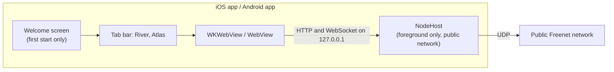
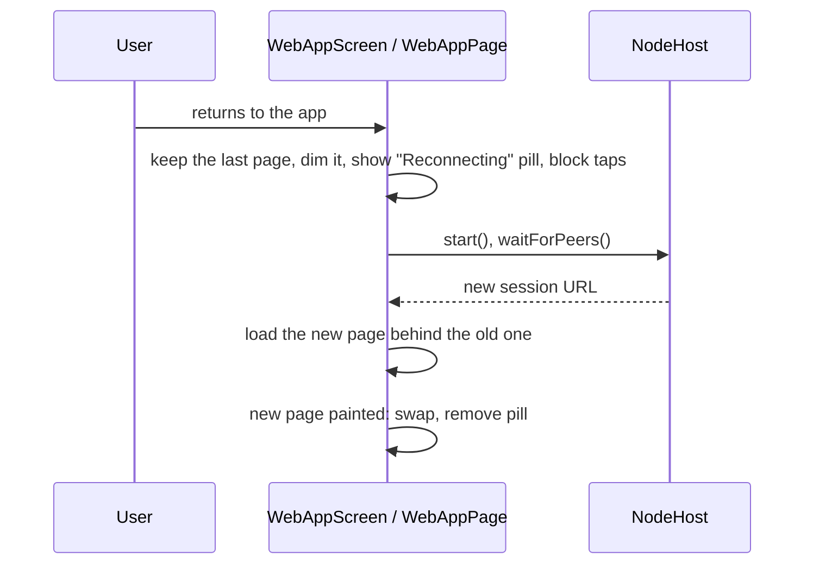

# Store build plan

Turn the iOS and Android demo apps into store builds that can go to TestFlight and Google Play internal testing, and later through App Review and Play review.

The store build:

- has two tabs, River and Atlas, on both platforms
- always joins the public network
- contains no measurement harness, profile switching, Native or Bridge screens, diagnostics or in-app logs
- fixes the upload blockers and review risks listed in [distribution review](distribution-review.md)



## Names

| Name | Value | Where it is used |
| --- | --- | --- |
| Short name | `AppKit` | Home screen and launcher label, alert prompts: iOS `INFOPLIST_KEY_CFBundleDisplayName`, Android `app_name` |
| Full name | `Freenet AppKit` | Welcome screen title, App Store Connect app name, Play store listing title: `AppInfo.fullName`, Android `app_full_name` |
| Identifier | `freenet.appkit` | iOS bundle ID and Android application ID |

## Decisions to confirm before Task 1

| Decision | Default in this plan | Where it is used |
| --- | --- | --- |
| Bundle ID and application ID | `freenet.appkit` (decided). The Kotlin package and Gradle `namespace` stay `org.freenet.appkit.demo` | Xcode `PRODUCT_BUNDLE_IDENTIFIER`, Gradle `applicationId` |
| Apple team | The project's paid Apple Developer Program team (the free personal team cannot use TestFlight) | `DEVELOPMENT_TEAM` for the archive script |
| Play account | The project's Play Console account | Upload key, internal testing track |
| Terms URL and support URL | Placeholders `https://freenet.org/terms` and `https://freenet.org/support` | `AppInfo.swift`, `AppInfo.kt`, store listings |
| Icon art | One 1024 × 1024 PNG with no transparency, plus the same art as a vector for Android | `art/` |
| Store category | iOS: Social Networking. Play: Communication | `INFOPLIST_KEY_LSApplicationCategoryType`, Play listing |

## Files

### iOS app (`ios/`)

| File | Change | Responsibility after the change |
| --- | --- | --- |
| `AppKitDemo/AppKitDemoApp.swift` | Edit | App entry, two-tab `ContentView`, alert banner, welcome sheet |
| `AppKitDemo/NodeHost.swift` | Edit | Owns the node: public network only, foreground only, alert grant |
| `AppKitDemo/WebAppScreen.swift` | Edit, split | `WebAppModel`, `WebAppScreen`, `LoadingView` |
| `AppKitDemo/WebAppView.swift` | New (split out) | `WebAppView` and its `Coordinator` |
| `AppKitDemo/AlertShim.swift` | New (split out) | The `Notification` shim script |
| `AppKitDemo/WebApps.swift` | New | `DemoWebApp` (moved from `AppResources.swift`) |
| `AppKitDemo/AppInfo.swift` | New | Short name, full name, terms URL, support URL |
| `AppKitDemo/LoadMessages.swift` | New | Plain-language loading and error messages |
| `AppKitDemo/WelcomeScreen.swift` | New | First-start screen |
| `AppKitDemo/Assets.xcassets/` | New | `AppIcon` |
| `AppKitDemo/PrivacyInfo.xcprivacy` | New | Required-reason API declarations |
| `AppKitDemo-Info.plist` | Edit | Encryption key, local network wording, file sharing removed |
| `AppKitDemo.xcodeproj/project.pbxproj` | Edit | Icon name, iPhone only, category, display name, bundle ID, `AppKitResources` removed |
| `ExportOptions.plist` | New | App Store Connect export settings |
| `AppKitDemo/Harness.swift`, `ProcessClock.swift`, `NetworkPath.swift`, `NativeRoute.swift`, `NativeRouteScreen.swift`, `BridgeTestScreen.swift`, `DiagnosticsScreen.swift`, `AppResources.swift` | Delete | – |

The Xcode project uses a file-system synchronized group for `AppKitDemo/`. Files added to or deleted from that folder need no `project.pbxproj` edit.

### Android app (`android/demo/`)

| File | Change | Responsibility after the change |
| --- | --- | --- |
| `src/main/java/.../MainActivity.kt` | Edit | Shell: tab bar, content, alert banner, back handling, insets, welcome |
| `src/main/java/.../NodeHost.kt` | Edit | Owns the node: public network only, foreground only, alert grant |
| `src/main/java/.../WebScreens.kt` | Split, then delete | – |
| `src/main/java/.../WebAppPage.kt` | New (split out) | `WebAppPage` |
| `src/main/java/.../LoadingView.kt` | New (split out) | `LoadingView` |
| `src/main/java/.../AlertShim.kt` | New (split out) | The `Notification` shim and frame report scripts |
| `src/main/java/.../WebApps.kt` | New | `DemoWebApp` (moved from `NodeHost.kt`) |
| `src/main/java/.../AppInfo.kt` | New | Terms URL, support URL, `openExternally` with the crash fix |
| `src/main/java/.../LoadMessages.kt` | New | Plain-language loading and error messages |
| `src/main/java/.../TabBar.kt` | New | Bottom tab bar with icons and a selected state |
| `src/main/java/.../WelcomeScreen.kt` | New | First-start screen |
| `src/main/res/mipmap-anydpi-v26/ic_launcher.xml` | New | Adaptive icon |
| `src/main/res/drawable/ic_launcher_foreground.xml`, `ic_tab_river.xml`, `ic_tab_atlas.xml` | New | Vector art |
| `src/main/res/values/colors.xml`, `strings.xml` | New | Icon background colour, `app_name`, `app_full_name` |
| `src/main/AndroidManifest.xml` | Edit | Icon, label, `profileable` removed, back callback opt-in |
| `build.gradle.kts` | Edit | Upload signing, `buildConfig`, version code from the command line |
| `proguard-rules.pro` | Edit | Harness keep rule removed |
| `src/main/java/.../Harness.kt`, `NativeRoute.kt` | Delete | – |
| `android/keystore.properties.example` | New | Template for the upload key settings |

### Repository

| Path | Change |
| --- | --- |
| `harness/` | Delete. `build-ios-app.sh` and `build-android-app.sh` move to `scripts/` first |
| `scripts/generate-fixtures.sh`, `scripts/fetch-webapps.sh`, `scripts/prepare-resources.sh` | Delete |
| `fixtures/`, `web/bridge-test/` | Delete |
| `scripts/check-store-build.sh` | New: checks a built store package for every item in this plan |
| `scripts/archive-ios.sh` | New: archive and export for App Store Connect |
| `scripts/bundle-android.sh` | New: signed AAB for Play |
| `art/icon-1024.png`, `art/icon-play-512.png` | New |
| `docs/review-notes.md` | New: text for App Review notes and Play testing instructions |
| `README.md`, `.gitignore` | Edit |
| `results/`, `docs/` (other files) | Unchanged: the record of 1.1 Mobile feasibility and supported profiles |

The Swift package (`Sources/FreenetAppKit/`) and the Kotlin library (`android/appkit/`) stay as they are.

## Reference

| Topic | Source |
| --- | --- |
| Privacy manifest reasons | [Describing use of required reason API](https://developer.apple.com/documentation/bundleresources/describing-use-of-required-reason-api) |
| iOS app icon | [Configuring your app icon](https://developer.apple.com/documentation/xcode/configuring-your-app-icon) |
| Encryption export | [Complying with encryption export regulations](https://developer.apple.com/documentation/security/complying-with-encryption-export-regulations) |
| TestFlight | [TestFlight overview](https://developer.apple.com/help/app-store-connect/test-a-beta-version/testflight-overview) |
| Android adaptive icon | [Adaptive icons](https://developer.android.com/develop/ui/views/launch/icon_design_adaptive) |
| Android signing | [Sign your app](https://developer.android.com/studio/publish/app-signing) |
| Android back | [Predictive back](https://developer.android.com/guide/navigation/custom-back/predictive-back-gesture) |
| Android insets | [Edge-to-edge](https://developer.android.com/develop/ui/views/layout/edge-to-edge) |
| Play internal testing | [Set up an open, closed or internal test](https://support.google.com/googleplay/android-developer/answer/9845334) |

The repository has no unit test targets. Each task checks its result with `scripts/check-store-build.sh`, a build, and a run on the iOS Simulator and the Android emulator (`Pixel_10`, API 37). End every commit message with the `Co-Authored-By` line the project uses.

---

## Task 0: Prepare

1. Tag the current commit so the 1.1 harness stays available:
   ```bash
   git tag plan-1.1-harness
   ```
2. Create the working branch:
   ```bash
   git switch -c store-build
   ```
3. Record the answers to [Decisions to confirm before Task 1](#decisions-to-confirm-before-task-1) at the top of this file.

## Task 1: Store build check script

`scripts/check-store-build.sh ios <path to .app>` and `scripts/check-store-build.sh android <path to .apk or .aab>` print one line per check and exit non-zero if any check fails.

| Platform | Check | Command |
| --- | --- | --- |
| iOS | App icon compiled | `Assets.car` exists and `plutil -extract CFBundleIcons raw Info.plist` succeeds |
| iOS | Privacy manifest present | `PrivacyInfo.xcprivacy` exists in the `.app` |
| iOS | Encryption key set | `plutil -extract ITSAppUsesNonExemptEncryption raw Info.plist` succeeds |
| iOS | No file sharing | `UIFileSharingEnabled` is absent |
| iOS | iPhone only | `UIDeviceFamily` is `[1]` |
| iOS | No harness | `strings AppKitDemo` has no `appkit.scenario` or `APPKIT_RESULT` (Swift keeps strings of 15 bytes or fewer in the code, so only the longer one is always found) |
| Android | Launcher icon | `aapt2 dump badging` shows `application-icon` |
| Android | Not profileable | `aapt2 dump xmltree --file AndroidManifest.xml` has no `profileable` |
| Android | Not debug-signed | The certificate from `apksigner verify --print-certs` (APK) or `keytool -printcert -jarfile` (AAB) is not `CN=Android Debug` |
| Android | 16 KB aligned | `zipalign -c -P 16 -v 4` passes (APK) |
| Android | No harness | `strings` of `classes*.dex` has no `appkit.scenario` or `APPKIT_RESULT` |

Steps:

1. Write `scripts/check-store-build.sh` with the checks above. Use `$ANDROID_SDK_ROOT/build-tools/<latest>/` for `aapt2`, `apksigner` and `zipalign`.
2. Build both apps with the current scripts:
   ```bash
   harness/build-ios-app.sh Release simulator
   ```
   ```bash
   harness/build-android-app.sh Release
   ```
3. Run the script on both outputs and confirm every check fails except the 16 KB check:
   ```bash
   scripts/check-store-build.sh ios build/ios/DerivedData/Build/Products/Release-iphonesimulator/AppKitDemo.app
   ```
   ```bash
   scripts/check-store-build.sh android android/demo/build/outputs/apk/release/demo-arm64-v8a-release.apk
   ```
4. Commit: `Add a check script for store builds`.

## Task 2: Remove the harness from the iOS app

1. Move `DemoWebApp` from `AppResources.swift` into a new `ios/AppKitDemo/WebApps.swift`. `DemoTab` gets two cases:
   ```swift
   enum DemoTab: Hashable {
       case river, atlas
   }
   ```
2. Delete `Harness.swift`, `ProcessClock.swift`, `NetworkPath.swift`, `NativeRoute.swift`, `NativeRouteScreen.swift`, `BridgeTestScreen.swift`, `DiagnosticsScreen.swift` and `AppResources.swift`.
3. In `AppKitDemoApp.swift`:
   - remove `ProcessClock` and `NetworkPath` from `init()` and `ProcessClock.markFirstFrame()` and `Harness.startIfRequested` from `onAppear`
   - keep only the River and Atlas tabs:
     ```swift
     TabView(selection: $host.selectedTab) {
         WebAppScreen(app: .river)
             .tabItem { Label("River", systemImage: "bubble.left.and.bubble.right") }
             .tag(DemoTab.river)
         WebAppScreen(app: .atlas)
             .tabItem { Label("Atlas", systemImage: "books.vertical") }
             .tag(DemoTab.atlas)
     }
     ```
   - remove the `harnessPrompt` branch of the `ZStack` and keep the `AlertBanner`.
4. In `NodeHost.swift`:
   - delete `NetworkProfile`, `profile`, `gatewayText`, `gatewayOverrides`, `backendChoice`, `apply(profile:)`, `lifecycleLog`, `log(_:)`, `preloaded`, `preloadIfLocal(_:)`, the event and lifecycle sinks and the `Keys` entries `profile`, `gateway`, `backend` and `riverQuery`
   - replace `settings(for:)` with one public-network setting:
     ```swift
     private func settings() -> NodeSettings {
         let lastPort = UInt16(clamping: defaults.integer(forKey: Keys.port))
         return directories.settings(mode: .network, preferredWsPort: lastPort == 0 ? nil : lastPort)
     }
     ```
   - in `scenePhaseChanged(_:)`, delete the harness check at the top
   - in `waitForPeers`, drop the `profile != .local` condition
   - in `webURL(for:)`, return `URL(string: text)` with no query.
5. In `WebAppScreen.swift`, delete `WebViews` and `WebTimeline` and every `timeline.mark` or `WebTimeline.shared.mark` call. Delete the `host.profile == .local` branch in `prepare` and in `pageText`. Keep the `appkitFrames` handler, which ends the loading view.
6. Split `WebAppScreen.swift`: move `WebAppView` and its `Coordinator` to `WebAppView.swift`, and `AlertShim` to `AlertShim.swift`.
7. Build for the simulator and fix every compile error:
   ```bash
   harness/build-ios-app.sh Release simulator
   ```
8. Run on the simulator. Check that there are two tabs and that River loads from the public network.
9. Commit: `iOS: keep only River and Atlas on the public network`.

## Task 3: Remove the harness from the Android app

1. Move `DemoWebApp` from `NodeHost.kt` into a new `WebApps.kt`.
2. Delete `Harness.kt` and `NativeRoute.kt`.
3. In `MainActivity.kt`:
   - delete `applyLaunchExtras()` and its call. This also removes the exported-activity bug where any app could set the gateway through intent extras
   - delete `startHarnessIfRequested()`, `harnessStarted`, `bridgeReport()`, `buildNativeScreen()`, `buildNodeScreen()`, `refreshNodeText()`, `progressRow()`, `monoText()`, `column()` and the `bridge`, `nativeView`, `nodeView`, `nodeText` and `nativeText` fields
   - `enum class Tab(val label: String) { RIVER("River"), ATLAS("Atlas") }`
   - `onStop()` calls `NodeHost.onBackground()` with no harness check
   - delete the `Harness.appInitUptimeMs` and `Harness.firstFrameUptimeMs` lines.
4. In `NodeHost.kt`:
   - delete `NetworkProfile`, `profile`, `gatewayText`, `gatewayOverrides`, `backend`, `backendChoice`, `apply()`, `preloaded`, `preloadIfLocal()`, `lifecycleLog`, `log()`, the event and lifecycle sinks, and the whole `AppResources` object
   - one public-network setting:
     ```kotlin
     private fun settings(): NodeSettings {
         val last = prefs.getInt("lastPort", 0)
         return directories.settings(NodeMode.NETWORK, preferredWsPort = if (last == 0) null else last.toUShort())
     }
     ```
   - in `waitForPeers`, drop the `NetworkProfile.LOCAL` condition.
5. Split `WebScreens.kt` into `WebAppPage.kt`, `LoadingView.kt` and `AlertShim.kt` (the `AlertShim` object with `FRAME_REPORT`). Move `openExternally` to `AppInfo.kt`. Delete `WebViews`, `WebTimeline`, `BridgePage`, every `WebTimeline.mark` call and the `NetworkProfile.LOCAL` branch in `prepare()` and `load()`. Then delete `WebScreens.kt`.
6. In `proguard-rules.pro`, delete the harness keep rule and its comment.
7. In `AndroidManifest.xml`, delete `<profileable android:shell="true" />` and its comment.
8. Build and fix every compile error:
   ```bash
   harness/build-android-app.sh Release
   ```
9. Install on the emulator and check that there are two tabs and that River loads from the public network:
   ```bash
   adb install -r android/demo/build/outputs/apk/release/demo-x86_64-release.apk
   ```
10. Commit: `Android: keep only River and Atlas on the public network`.

## Task 4: Remove harness resources and scripts

1. Move the app build scripts:
   ```bash
   git mv harness/build-ios-app.sh scripts/build-ios-app.sh
   ```
   ```bash
   git mv harness/build-android-app.sh scripts/build-android-app.sh
   ```
   In both, fix the `cd "$(dirname "$0")/.."` paths if needed.
2. Delete `harness/`, `scripts/generate-fixtures.sh`, `scripts/fetch-webapps.sh`, `scripts/prepare-resources.sh`, `fixtures/` and `web/bridge-test/`.
3. In `ios/AppKitDemo.xcodeproj/project.pbxproj`, remove the three `AppKitResources` lines: the `PBXBuildFile` (`F7E0A1B2C3D4E5F60000000C`), the `PBXFileReference` (`F7E0A1B2C3D4E5F600000006`), its entry in the main group's `children`, and its entry in the Resources build phase's `files`.
4. Delete the local folders `ios/AppKitResources/` and `android/demo/src/main/assets/AppKitResources/`.
5. In `.gitignore`, remove the sections "Fetched website containers", "Harness scratch" and "Generated resources". Add `android/keystore.properties` and `*.keystore`.
6. Rewrite `README.md`:
   - what the app is (River and Atlas on an embedded node, public network, foreground only)
   - build steps: Rust targets, `scripts/build-ios.sh`, `scripts/build-android.sh`, `scripts/build-ios-app.sh`, `scripts/build-android-app.sh`, and the store scripts from Task 11
   - one line: the harness and the measurement scenarios for 1.1 Mobile feasibility and supported profiles are at tag `plan-1.1-harness`, and `results/` and `docs/` hold their results
   - remove the Bridge and Native boxes from the diagram.
7. Build both apps with the moved scripts. Run the check script. Both "No harness" checks now pass.
8. Commit: `Remove the harness, fixtures and bundled resources`.

## Task 5: iOS store blockers

1. **App icon.** Create `ios/AppKitDemo/Assets.xcassets/Contents.json` and `AppIcon.appiconset/` with one 1024 × 1024 entry:
   ```json
   {
     "images": [{ "filename": "icon-1024.png", "idiom": "universal", "platform": "ios", "size": "1024x1024" }],
     "info": { "author": "xcode", "version": 1 }
   }
   ```
   Copy `art/icon-1024.png` into the set. In both build configurations in `project.pbxproj`, add `ASSETCATALOG_COMPILER_APPICON_NAME = AppIcon;`.
2. **Privacy manifest.** Create `ios/AppKitDemo/PrivacyInfo.xcprivacy`. `libfreenet_mobile.a` calls `stat`, `fstat`, `lstat` and `fstatat` (file timestamps) and `statfs`, `fstatfs`, `statvfs` and `fstatvfs` (disk space). The app uses `UserDefaults`.
   ```xml
   <?xml version="1.0" encoding="UTF-8"?>
   <!DOCTYPE plist PUBLIC "-//Apple//DTD PLIST 1.0//EN" "http://www.apple.com/DTDs/PropertyList-1.0.dtd">
   <plist version="1.0">
   <dict>
       <key>NSPrivacyTracking</key><false/>
       <key>NSPrivacyTrackingDomains</key><array/>
       <key>NSPrivacyCollectedDataTypes</key><array/>
       <key>NSPrivacyAccessedAPITypes</key>
       <array>
           <dict>
               <key>NSPrivacyAccessedAPIType</key><string>NSPrivacyAccessedAPICategoryFileTimestamp</string>
               <key>NSPrivacyAccessedAPITypeReasons</key><array><string>C617.1</string></array>
           </dict>
           <dict>
               <key>NSPrivacyAccessedAPIType</key><string>NSPrivacyAccessedAPICategoryDiskSpace</string>
               <key>NSPrivacyAccessedAPITypeReasons</key><array><string>E174.1</string></array>
           </dict>
           <dict>
               <key>NSPrivacyAccessedAPIType</key><string>NSPrivacyAccessedAPICategoryUserDefaults</string>
               <key>NSPrivacyAccessedAPITypeReasons</key><array><string>CA92.1</string></array>
           </dict>
       </array>
   </dict>
   </plist>
   ```
   After each Core update, list the library's symbols again and add any new category:
   ```bash
   nm -u ../freenet-core/target/aarch64-apple-ios/release/libfreenet_mobile.a | grep -E '_(f?stat|lstat|fstatat|getattrlist|f?statv?fs|mach_absolute_time)$' | sort -u
   ```
3. **Info.plist** (`ios/AppKitDemo-Info.plist`):
   - add `ITSAppUsesNonExemptEncryption` = `true`. The node uses X25519, AES-GCM, ChaCha20, Ed25519 and BLAKE3 outside the OS. Answer the export questions for the first build in App Store Connect. If App Store Connect gives a compliance code, add it as `ITSEncryptionExportComplianceCode`
   - delete `UIFileSharingEnabled`, `LSSupportsOpeningDocumentsInPlace` and their comment
   - change `NSLocalNetworkUsageDescription` to: `Freenet connects directly to other Freenet peers on your Wi-Fi network.`
4. **Project settings** (both configurations in `project.pbxproj`):
   - `TARGETED_DEVICE_FAMILY = 1;`
   - delete `INFOPLIST_KEY_UISupportedInterfaceOrientations_iPad`
   - `INFOPLIST_KEY_CFBundleDisplayName = AppKit;`
   - `PRODUCT_BUNDLE_IDENTIFIER = freenet.appkit;`
   - `INFOPLIST_KEY_LSApplicationCategoryType = "public.app-category.social-networking";`
5. **Web inspector in debug builds only.** In `WebAppView.swift`:
   ```swift
   #if DEBUG
   if #available(iOS 16.4, *) { webView.isInspectable = true }
   #endif
   ```
6. **No crash when the node's folders can't be created.** In `NodeHost.swift`, change `directories` to `NodeDirectories?` set with `try? NodeDirectories.standard()`. In `start()`, when it is `nil`, set `lastError` and return `nil`, so the loading view shows its error and the "Try again" button.
7. Build, run the check script on the `.app`, and confirm every iOS check passes. Run on the simulator and check that the home screen shows the icon and "AppKit".
8. Commit: `iOS: icon, privacy manifest, encryption key and iPhone only`.

## Task 6: Android store blockers

1. **Launcher icon.**
   - `res/mipmap-anydpi-v26/ic_launcher.xml`:
     ```xml
     <adaptive-icon xmlns:android="http://schemas.android.com/apk/res/android">
         <background android:drawable="@color/ic_launcher_background" />
         <foreground android:drawable="@drawable/ic_launcher_foreground" />
         <monochrome android:drawable="@drawable/ic_launcher_foreground" />
     </adaptive-icon>
     ```
   - `res/drawable/ic_launcher_foreground.xml`: the icon art as a 108 dp vector with the art inside the central 72 dp
   - `res/values/colors.xml`: `ic_launcher_background`
   - `res/values/strings.xml`: `app_name` = `AppKit`, `app_full_name` = `Freenet AppKit`
   - in `build.gradle.kts`, `applicationId = "freenet.appkit"`
   - in `AndroidManifest.xml` on `<application>`: `android:icon="@mipmap/ic_launcher"`, `android:roundIcon="@mipmap/ic_launcher"`, `android:label="@string/app_name"`
   - export `art/icon-play-512.png` for the Play listing:
     ```bash
     sips -z 512 512 art/icon-1024.png --out art/icon-play-512.png
     ```
2. **Upload signing** in `android/demo/build.gradle.kts`:
   ```kotlin
   val keystoreProps = rootProject.file("keystore.properties").takeIf { it.exists() }?.let { file ->
       java.util.Properties().apply { file.inputStream().use { load(it) } }
   }

   android {
       signingConfigs {
           if (keystoreProps != null) create("upload") {
               storeFile = rootProject.file(keystoreProps.getProperty("storeFile"))
               storePassword = keystoreProps.getProperty("storePassword")
               keyAlias = keystoreProps.getProperty("keyAlias")
               keyPassword = keystoreProps.getProperty("keyPassword")
           }
       }
       buildTypes {
           release {
               signingConfig = signingConfigs.findByName("upload") ?: signingConfigs.getByName("debug")
           }
       }
   }
   ```
   Add `android/keystore.properties.example` with the four keys and no values. Create the upload key with `keytool -genkeypair -v -keystore upload.keystore -alias upload -keyalg RSA -keysize 4096 -validity 10000`. Keep the key and its passwords in the project's password manager, never in git.
3. **Version code from the command line.** In `defaultConfig`:
   ```kotlin
   versionCode = (project.findProperty("versionCode") as String?)?.toInt() ?: 1
   versionName = (project.findProperty("versionName") as String?) ?: "0.1"
   ```
4. **BuildConfig.** Add `buildFeatures { buildConfig = true }` to `android { }`.
5. **Web inspector in debug builds only.** In `WebAppPage.kt`, replace `WebView.setWebContentsDebuggingEnabled(true)` with:
   ```kotlin
   if (BuildConfig.DEBUG) WebView.setWebContentsDebuggingEnabled(true)
   ```
6. **No crash on links with no handler.** In `AppInfo.kt`:
   ```kotlin
   fun openExternally(context: Context, uri: Uri) {
       try {
           context.startActivity(Intent(Intent.ACTION_VIEW, uri))
       } catch (e: ActivityNotFoundException) {
           Toast.makeText(context, "No app can open this link", Toast.LENGTH_SHORT).show()
       }
   }
   ```
   In `WebAppPage.onCreateWindow`, call `openExternally(context, target)` instead of `context.startActivity(...)`. Open only `http`, `https` and `mailto` links and ignore other schemes.
7. Build, run the check script on the APK, and confirm every Android check passes, with "Not debug-signed" passing once `keystore.properties` exists. On the emulator, check the launcher icon and name.
8. Commit: `Android: icon, upload signing and debug-only web inspector`.

## Task 7: Navigation

### Android tab bar

1. Create `res/drawable/ic_tab_river.xml` and `ic_tab_atlas.xml`: 24 dp vectors, chat bubbles and books, matching the iOS SF Symbols.
2. Create `TabBar.kt`: a horizontal `LinearLayout` with one item per tab. Each item:
   - is a vertical icon and label, at least 56 dp high
   - takes the theme's `colorAccent` when selected and `textColorSecondary` when not
   - sets `isSelected` and `contentDescription` (`"River, tab 1 of 2"`), so TalkBack reads it
   - calls `onSelect(tab)` on tap.
3. In `MainActivity.buildShell()`, replace the row of `Button`s with `TabBar`. In `select(tab)`, update the tab bar's selected item.

### Android insets

1. The app targets API 36, so Android 15 and later draw it edge to edge. Remove `fitsSystemWindows = true` from the root. Pad the root for the system bars and the keyboard:
   ```kotlin
   root.setOnApplyWindowInsetsListener { v, insets ->
       val bars = insets.getInsets(WindowInsets.Type.systemBars() or WindowInsets.Type.ime())
       v.setPadding(bars.left, bars.top, bars.right, bars.bottom)
       WindowInsets.CONSUMED
   }
   ```
   On API 26 to 29, use `insets.systemWindowInsetLeft`, `Top`, `Right` and `Bottom` instead.
2. On the emulator, open River, tap the message field and check that the keyboard does not cover it.

### Back navigation

1. **Android.**
   - add `android:enableOnBackInvokedCallback="true"` to `<application>`
   - `WebAppPage` exposes `canGoBack()` and `goBack()` on its current `WebView`, and calls a `onHistoryChanged` callback from `WebViewClient.doUpdateVisitedHistory`
   - in `MainActivity`, register an `OnBackInvokedCallback` (API 33 and later) only while the current page `canGoBack()`, and unregister it when it can't. The system's own back-to-home then runs when there is nothing to go back to
   - for API 26 to 32, override `onBackPressed()`: go back in the page if it can, otherwise call `super.onBackPressed()`.
2. **iOS.** In `WebAppView.makeUIView`, set `webView.allowsBackForwardNavigationGestures = true`.
3. Check on both: open a room in River, go back with the back gesture, and River shows the room list.
4. Commit: `Tab bar, insets and back navigation`.

## Task 8: Plain loading and error messages

1. Create `LoadMessages.swift` and `LoadMessages.kt` with the same text:

   | State | Title | Detail (hidden behind "Details") |
   | --- | --- | --- |
   | Starting | "Starting Freenet" | – |
   | Waiting for a peer, first 10 s | "Connecting to the Freenet network" | – |
   | Waiting for a peer, after 10 s | "Connecting to the Freenet network. The first connection can take up to a minute." | – |
   | Fetching the web app | "Downloading River" / "Downloading Atlas" | – |
   | Starting the web app | "Opening River" / "Opening Atlas" | – |
   | Node did not start | "Freenet could not start." | `lastError` |
   | No peer answered | "Freenet could not reach the network. Check your internet connection. Some Wi-Fi networks block Freenet's traffic; mobile data may work." | `lastError` |
   | Page failed | "River could not open." | the WebKit or WebView error |

2. `LoadingView` on both platforms gets a "Details" button under the error. It shows the detail text in a small monospaced font, selectable, so testers can copy it into a report.
3. Replace every string in `WebAppModel.prepare`, `WebAppModel.pageText` (iOS) and `WebAppPage.prepare`, `WebAppPage.load` and `WebAppPage.loadFailed` (Android) with the `LoadMessages` values. Start a 10 s timer when the peer wait begins, to switch to the longer text.
4. Check on both: turn networking off (Simulator: Network Link Conditioner, 100% loss. Emulator: `adb shell svc wifi disable` and `adb shell svc data disable`), open River, and wait for the "could not reach" message, the "Try again" button and the "Details" button.
5. Commit: `Plain loading and error messages`.

## Task 9: Keep the page on screen while reconnecting

The node stops when the app goes to the background and starts a new session when it returns, so each web app loads again. The page the user saw stays on screen until the new one has drawn.



1. **iOS.**
   - add `case reconnecting` to `PageState`
   - in `WebAppModel.prepare`, when `page == .shown` (a page was already on screen), keep `url` as it is, set `page = .reconnecting`, and set `url` to the new session's URL only after `waitForPeers` succeeds
   - in `WebAppScreen`, for `.reconnecting`, show a small top-aligned capsule with a `ProgressView` and "Reconnecting" in place of the full-screen `LoadingView`. Apply `.allowsHitTesting(false)` and `.opacity(0.6)` to the web view
   - `WebAppView.updateUIView` loads the new URL into the same `WKWebView`. WebKit keeps the old page on screen until the new one has drawn, and the `painted` message sets `page = .shown`
   - if the reconnect fails, show the full-screen error from Task 8.
2. **Android.**
   - in `WebAppPage.prepare`, when a page was shown, keep the current `WebView`, add a small "Reconnecting" pill on top of it, and add a transparent view on top that takes all taps
   - `load(url)` creates the new `WebView` at index 0, behind the old one. In `reveal()`, remove and destroy the old `WebView` and the pill
   - if the reconnect fails, destroy the old `WebView` and show the full-screen error from Task 8.
3. Check on both: open River and wait for it to load, switch to another app for 10 s, and come back. River's last screen stays visible with the "Reconnecting" pill, then becomes interactive with no blank screen in between.
4. Commit: `Keep the page on screen while reconnecting`.

## Task 10: Welcome screen and app name in prompts

1. Create `AppInfo.swift` and `AppInfo.kt` with `shortName` (`AppKit`, read from the bundle or `applicationInfo.loadLabel`), `fullName` (`Freenet AppKit`), `termsURL` and `supportURL`.
2. Create `WelcomeScreen.swift` and `WelcomeScreen.kt`. It shows once, on first start, over everything:
   - the icon and "Freenet AppKit"
   - three short lines: "Chat with River and browse Atlas, served by Freenet running on your phone." / "Freenet connects directly to other people's devices. It runs only while this app is open." / "What you post is shared with other people on the network."
   - "By continuing you agree to the Terms." with "Terms" linked to `termsURL`, and a "Support" link to `supportURL`
   - a "Continue" button that stores `welcomeSeen = true` (`UserDefaults` / `SharedPreferences`).
   The node starts only after "Continue", so the local network prompt on iOS appears after the welcome screen.
3. iOS: present it with `.fullScreenCover` from `ContentView` while `welcomeSeen` is false. Android: `MainActivity` shows `WelcomeScreen.view` in place of the shell until "Continue".
4. In the alert permission prompts, replace "AppKit Demo" with `AppInfo.shortName`: `WebAppView.Coordinator.askPermission` (iOS) and `WebAppPage.askPermission` (Android).
5. Check on both: delete the app, install it again, and see the welcome screen once. After "Continue", River loads. Start the app again and the welcome screen does not show.
6. Commit: `Welcome screen with terms and support links`.

## Task 11: Store packaging scripts

1. **iOS.** Create `ios/ExportOptions.plist`:
   ```xml
   <dict>
       <key>method</key><string>app-store-connect</string>
       <key>destination</key><string>upload</string>
       <key>signingStyle</key><string>automatic</string>
       <key>teamID</key><string>$(DEVELOPMENT_TEAM)</string>
   </dict>
   ```
   Create `scripts/archive-ios.sh`. It needs `DEVELOPMENT_TEAM` and `BUILD_NUMBER`, which must go up on every upload:
   ```bash
   xcodebuild -project ios/AppKitDemo.xcodeproj -scheme AppKitDemo -configuration Release \
     -destination 'generic/platform=iOS' -archivePath build/ios/AppKitDemo.xcarchive \
     DEVELOPMENT_TEAM="$DEVELOPMENT_TEAM" CURRENT_PROJECT_VERSION="$BUILD_NUMBER" \
     -allowProvisioningUpdates archive
   xcodebuild -exportArchive -archivePath build/ios/AppKitDemo.xcarchive \
     -exportOptionsPlist ios/ExportOptions.plist -exportPath build/ios/export -allowProvisioningUpdates
   ```
   Then it runs `scripts/check-store-build.sh ios build/ios/AppKitDemo.xcarchive/Products/Applications/AppKitDemo.app`. Write `teamID` into the plist from `DEVELOPMENT_TEAM` with `plutil -replace` before the export.
2. **Android.** Create `scripts/bundle-android.sh`. It needs `VERSION_CODE`:
   ```bash
   ./gradlew --no-configuration-cache -q :demo:bundleRelease -PversionCode="$VERSION_CODE"
   ```
   Then it runs `scripts/check-store-build.sh android android/demo/build/outputs/bundle/release/demo-release.aab`. It stops if `android/keystore.properties` is missing.
3. Run both scripts. Every check passes.
4. Commit: `Scripts for App Store Connect and Play uploads`.

## Task 12: Review notes and first uploads

1. Write `docs/review-notes.md` with two sections of paste-ready text:
   - **App Review notes (App Store Connect → App Review Information).** What the app does. That it runs a Freenet peer inside the app and reaches other peers over UDP. That the first connection can take up to a minute, and networks that block UDP show the "could not reach" message. That no sign-in is needed. The steps to create a River room and send a message. A link to a screen recording of those steps on an iPhone and on an Android phone. The support contact.
   - **Play testing instructions (Play Console → App content → App access).** The same text.
2. Record the screen recordings on the iPhone 13 mini and on the Android emulator.
3. iOS: create the app record in App Store Connect with the name "Freenet AppKit" and bundle ID `freenet.appkit`, then upload `build/ios/export/AppKitDemo.ipa` with Xcode Organizer or `xcrun altool --upload-app`. In App Store Connect, answer the encryption questions, add the team as internal testers, and install from TestFlight on the iPhone.
4. Android: create the app in Play Console with the name "Freenet AppKit", turn on Play App Signing, upload the AAB to the internal testing track, add testers by email, and install from the Play opt-in link on a device or the emulator with the Play Store.
5. On each installed store build, go through this list:

   | Check | iOS | Android |
   | --- | --- | --- |
   | Icon and name on the home screen | | |
   | Welcome screen once, links open | | |
   | River loads on Wi-Fi and on mobile data | | |
   | Atlas loads | | |
   | Back gesture inside River | | |
   | Leave for 10 s and return: page stays, "Reconnecting", then usable | | |
   | Airplane mode: plain error, "Try again", "Details" | | |
   | Message alert while on the Atlas tab opens River | | |
   | Keyboard does not cover River's message field | | |

6. Commit: `Review notes for App Review and Play`.
